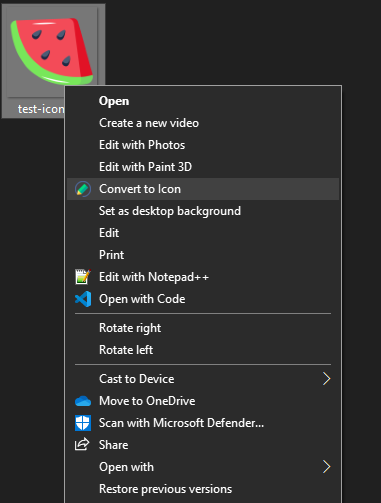

# Video Compressor for Windows

A simple context menu option for converting `.png` to '.ico`

## Installation

1. Download and install the latest [ImageMagick](https://imagemagick.org/script/download.php).
  
2. Run the `install png to ico.reg`.

Now, you can right-click on any `.png` file and choose `convert to icon`

## License
This project is open-source. Feel free to use, modify, and distribute.

## 🌱 Support & Contributions
If these tools save you time:
- Please⭐ <a href="../../../stargazers" target="_blank">Star</a> to help spread useful tools.
- <a href="https://buymeacoffee.com/spark88" target="_blank">Buy me a coffee</a> to fuel more dev tools.
- or <a href="../../../fork" target="_blank">Contribute</a> - Released under MIT license.
