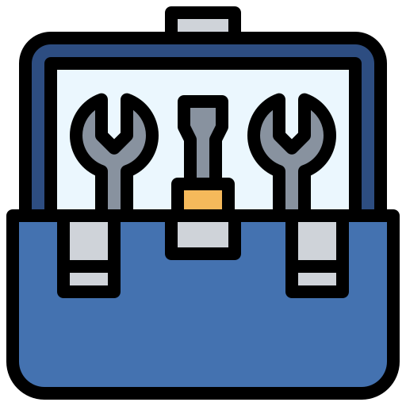

[//]: # (Constants)
[privacy-link]: ./PRIVACY.md
[coffee-link]: https://buymeacoffee.com/spark88

# 🛠️ Windows Context Menu Tools

[Privacy Policy][privacy-link] • [Report Bug](../../issues) • [Buy me a Coffee][coffee-link]

A collection of handy right-click tools to make your multimedia tasks a breeze!

## 🚀 Quick Start
1. Choose your tool:
   - **[Video Compressor](./VideoCompressor/Readme.md)** Reduce video size without quality loss
   - **[Png 2 Icon](./Png2Icon/Readme.md)** Convert PNG images to Windows icons
   - **[Background Remover](./RemoveBG/Readme.md)** Remove image backgrounds instantly
   - **[MKV to MP4](./mkv2mp4/Readme.md)** Convert video formats with one click

## 🌱 Support & Contributions
If these tools save you time (and disk space 😉):
- Please⭐ [Star](../../stargazers) to help spread useful tools.
- [Buy me a coffee][coffee-link] to fuel more dev tools.
- or [Contribute](../../fork) - Released under MIT license.