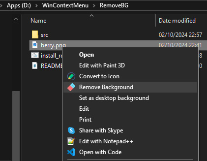

# Remove Background for Windows

A simple context menu option for removing backgrounds from `.png` files using the **remove.bg** CLI.

## Installation

1. Download and extract the **remove.bg** CLI from [Remove.bg CLI GitHub](https://github.com/remove-bg).
   
2. Place all the extracted files (including `apikey.txt`, `removebg_batch.bat`, and `install.reg`) into the `D:\\WinContextMenu\\RemoveBG\\src` folder.

3. Add your remove.bg API key to the `apikey.txt` file inside `D:\\WinContextMenu\\RemoveBG\\src`.

4. Run `install_removebg.bat` as Administrator. This will:
    - Install the **removebg** CLI.
    - Set up the context menu option for `.png` files to remove the background.

Now, you can right-click on any `.png` file and choose **Remove Background**.

## License
This project is open-source. Feel free to use, modify, and distribute.

