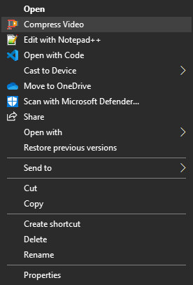

# Video Compressor for Windows

A simple context menu option for compressing `.mp4` videos using FFmpeg.

## Installation

1. Download and install the latest [FFmpeg](https://codecguide.com/download_k-lite_codec_pack_basic.htm).
  
2. Run the `InstallVideoCompresser.reg`.

Now, you can right-click on any `.mp4` file and choose "Compress Video" to compress the file.

ps. you can change the compression rate by changing the `CompressVideo.bat`

>**example:** Compress the video with 1500k bitrate
```shell
ffmpeg.exe -i "!INPUT!" -b:v 1500k "!OUTPUT!"
```



## 🌱 Support & Contributions
If these tools save you time:
- Please⭐ <a href="../../../stargazers" target="_blank">Star</a> to help spread useful tools.
- <a href="https://buymeacoffee.com/spark88" target="_blank">Buy me a coffee</a> to fuel more dev tools.
- or <a href="../../../fork" target="_blank">Contribute</a> - Released under MIT license.