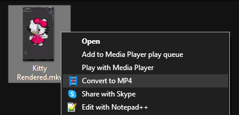

#  <span style="vertical-align: middle;">MKV to MP4 Converter for Windows</span>

A simple context menu option for converting `.mkv` videos to `.mp4` format using FFmpeg.

## Installation

1. Download and install the latest [FFmpeg](https://codecguide.com/download_k-lite_codec_pack_basic.htm).
  
2. Run the `InstallMkv2Mp4.reg`.

Now, you can right-click on any `.mkv` file and choose "Convert to MP4" to convert the file.

The conversion uses copy mode which preserves the original video and audio quality without re-encoding.

```shell
ffmpeg.exe -i "!INPUT!" -c:v copy -c:a copy "!OUTPUT!"
```

